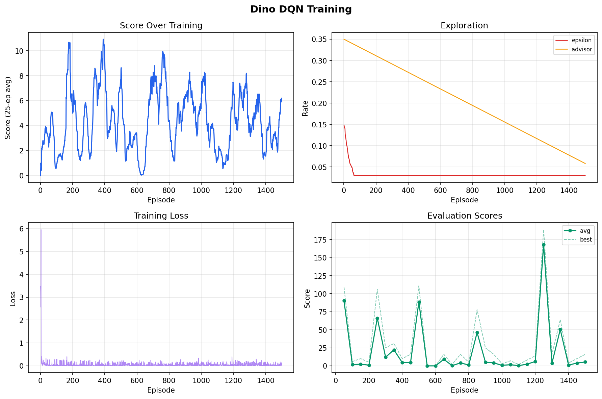

# Dino Trainer

This is my Chrome-Dino reinforcement learning project. I built a small Pygame version of the Dino game and trained a neural network to choose between:

- run
- jump
- duck

The main thing I wanted to learn was how a DQN-style agent is put together outside of a tutorial: the game loop, the state representation, replay memory, target networks, checkpoints, and evaluation.

## What Is In The Project

```text
dino_game.py       # the Pygame environment
dino_ai.py         # the neural network agent
train.py           # training, evaluation, checkpoints, and demos
plot_training.py   # training curve visualization
```

The project uses:

- a Gym-like `reset()` / `step()` game API
- a 9-value state vector instead of raw pixels
- DQN with replay memory
- a target network
- Double DQN target calculation
- epsilon-greedy exploration
- score-based curriculum learning (cacti → birds → full)
- expert demonstrations for a warm start (behavior cloning)
- CSV metrics for training and evaluation runs

## Training Curves



## Setup

```bash
python3 -m venv .venv
source .venv/bin/activate
pip install -r requirements.txt
```

## Training

Basic training:

```bash
python train.py --episodes 500
```

Training with the game window open:

```bash
python train.py --episodes 500 --render
```

The stronger training setup uses a short imitation-learning phase first. The expert policy gives examples of when to jump and duck, then the DQN can keep training from that better starting point.

```bash
python train.py --episodes 1500 --imitation-episodes 80 --imitation-epochs 10 --expert-warmup 40
```

Training creates:

- `checkpoints/dino_dqn.pt`
- `checkpoints/dino_dqn_best.pt`
- `runs/<timestamp>/training_metrics.csv`
- `runs/<timestamp>/eval_metrics.csv`

The `.pt` files are PyTorch checkpoints. They store the model weights and training state so I can demo or evaluate the agent without retraining every time.

## Plotting

After a training run, plot the curves:

```bash
python plot_training.py runs/<timestamp> --save
```

This generates a 4-panel chart: score over training, exploration rates, training loss, and evaluation scores.

## Demo

```bash
python train.py --demo
```

There are three policies I can run:

```bash
python train.py --demo --policy agent
python train.py --demo --policy expert
python train.py --demo --policy hybrid
```

`agent` is the neural network. `expert` is the hand-written teacher policy. `hybrid` uses the network most of the time but has a safety override near obstacles.

## Evaluation

This runs games without exploration and prints the scores:

```bash
python train.py --evaluate --policy agent --eval-episodes 5 --max-frames 12000
```

`--max-frames` is just a cap so evaluation does not run forever if the agent survives for a long time. It is not the score.

Latest local result:

```text
Policy=agent
Evaluation avg_score=167.95 best_score=189 episodes=20
```

## State Vector

The model does not see the screen pixels. It gets these values:

1. dino y-position
2. dino vertical velocity
3. whether the dino is ducking
4. distance to the next obstacle
5. obstacle y-position
6. obstacle width
7. obstacle height
8. current obstacle speed
9. whether the obstacle is a bird

I normalized these values before giving them to the network. That made training much easier than using raw pixel numbers.

## How The DQN Update Works

The basic target is:

```text
target = reward + gamma * future_value
```

For Double DQN, the online network chooses the next action and the target network estimates the value of that action:

```text
next_action = argmax(Q_online(next_state))
target = reward + gamma * Q_target(next_state, next_action)
```

The target network is copied from the online network every few training steps. That keeps the target from moving around too much while the model is learning.

## What I Learned

- **Reward shaping matters a lot.** My survival reward was too high relative to action rewards, which made the agent prefer sitting still. Scaling it down fixed that.
- **Imitation learning class weights need to be inverted.** Minority actions (jump, duck) need higher weight, not majority (stay). Getting this wrong silently undermines the whole warmstart.
- **Curriculum learning needs hysteresis.** If you advance stages based on score, you need to prevent the agent from dropping back to easier stages when scores temporarily dip.
- **Epsilon should only decay on agent-chosen actions.** If an expert advisor picks the action, the agent didn't actually explore, so epsilon shouldn't tick down.
- **Fixed eval seeds give cleaner learning curves.** Changing the seed every eval cycle adds noise that makes it hard to tell if the agent is actually improving.

## Things I Would Improve Next

- try a CNN version that learns from pixels
- compare pure DQN vs imitation warm start
- package the demo as a small web or Chrome extension version
- add prioritized experience replay
